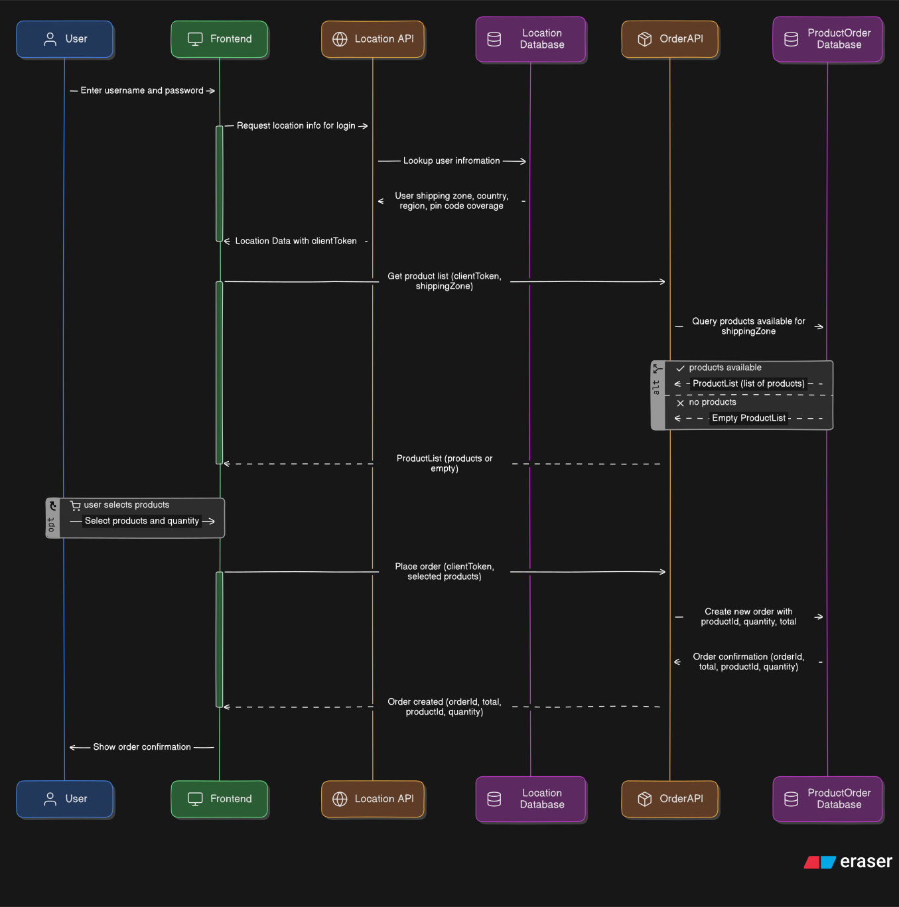

# 🚀 Specmatic Arazzo Demo

[Specmatic Arazzo](https://hub.docker.com/extensions/specmatic/specmatic-docker-desktop-extension) is a **NO-CODE** workflow testing tool that allows users to efficiently **author**, **validate**, **test**, and **mock** workflows, leveraging [Arazzo API Specifications](https://spec.openapis.org/arazzo/latest.html)

## 🎬 Video Walkthrough

[](https://youtu.be/jrkFKh37_N0)

This video uses this very same demo project repo to showcases how to author a workflow specification using **Specmatic Arazzo** via [**Specmatic Studio**](https://specmatic.io/specmatic-studio/) interactively with a drag‑and‑drop interface, validate the workflow, and test it against two microservices [**Order API**](./backend/order_api) and the [**Location API**](./backend/location_api), We will also demonstrate how to mock the workflow so that the [**Frontend**](./frontend) can consume it independently from these microservices without a single line of code.

You can also use this repo to follow along with the video and learn about the various capabilities. Please do read through the detailed instructions below to know more.

## 🏗️ Application Architecture

This project includes below services:
- Backend Services (developed using **FastAPI**, **SQLModel**, and **SQLite**)
  - [**Order API**](./backend/order_api)
  - [**Location API**](./backend/location_api)
- Frontend (built using **Svelte** and **Vite**)
  - [**UI that interacts with the two backend services**](./frontend)

## 🛠️ Prerequisites

- [Python](https://www.python.org/)
- [Node.js](https://nodejs.org/en/download/)
- [Docker Desktop](https://www.docker.com/products/docker-desktop/)
- [Specmatic Docker Extension](https://hub.docker.com/extensions/specmatic/specmatic-docker-desktop-extension)

## 🔧 Setup

### Clone the Specmatic Arazzo UI Sample repository:
```shell
git clone https://github.com/specmatic/specmatic-arazzo-ui-sample
```

### Launch the Extension:
Launch it within the Specmatic Arazzo UI Sample project directory as shown in the image below


## 📝 Flow



## Running the Project

Execute [`run.py`](./run.py) to get both Front-end and Back-end running.
Please choose appropriate commands below as per your system setup.

For Windows:
```shell
python run.py
```

For Unix:
```shell
python3 run.py
```

### What does `run.py` do?

1. In the [`backend`](./backend/) directory:
   1. Creates a `venv` virtual environment.
   2. Installs Python dependencies from [`requirements.txt`](./backend/requirements.txt).
   3. Starts both the [`order_api`](./backend/order_api/) and [`location_api`](./backend/location_api/) microservices.
   4. Populates the database with dummy data.

2. In the [`frontend`](./frontend/) directory:
   1. Installs the frontend dependencies specified in [`package.json`](./frontend/package.json).
   2. Launches the frontend application in development mode using Vite.
   3. Opens the frontend in a web browser.

### Verify the setup
1. In the [UI](http://localhost:5173) please use username as `test@specmatic.io` and password as `specmatic`. This should show you a couple of products.
2. Now you can log out and try again with username as `random@specmatic.io` and password as `user`. This shows you an empty list.

### Input for backend workflow testing

```json
{
    "PlaceOrder": {
        "DEFAULT": {
            "GetUserDetails": {
                "email": "test@specmatic.io",
                "password": "specmatic",
                "internalToken": "API-TOKEN"
            }
        },
        "RetrieveProducts.IsArrayEmpty": {
            "$failureMessage": "Expected not to find any products for random@specmatic.io, as they belong to B Zone",
            "GetUserDetails": {
                "email": "random@specmatic.io",
                "password": "user"
            }
        }
    }
}
```

### Start only the frontend
```shell
cd frontend
npm install
npm run dev
```

### Test the backend
```shell
cd backend
python3 -m venv venv
source venv/bin/activate  # On Windows use `venv\Scripts\activate`
pip install -r requirements.txt
python3 run.py
```